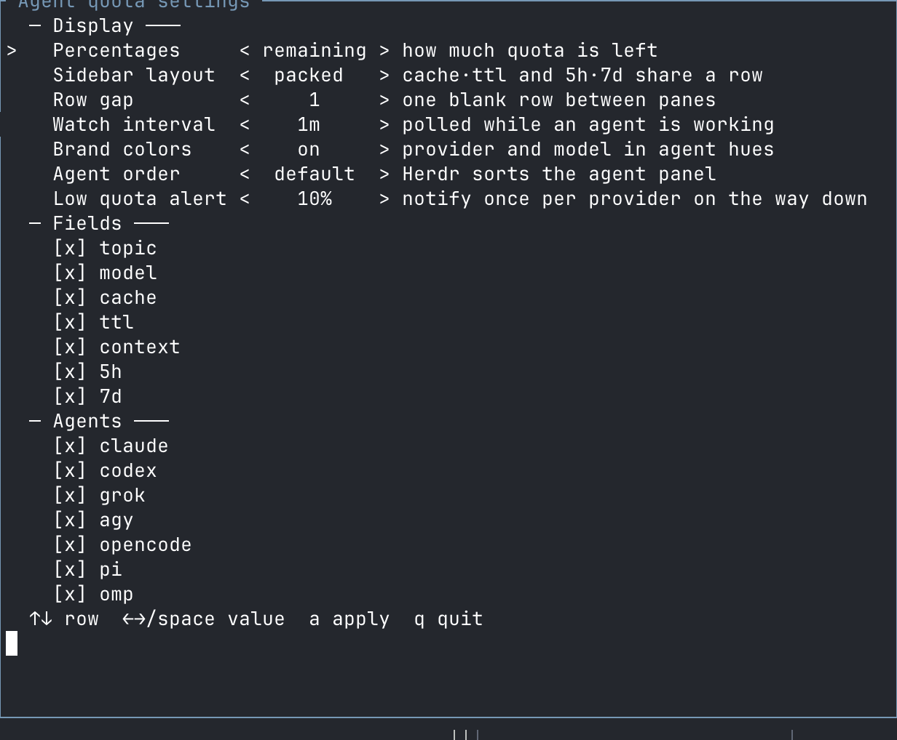

# herdr-agent-usage

This component lives in `useful_tools/herdr_usage/` and is a personal fork of
[levi-qiao/herdr-agent-usage](https://github.com/levi-qiao/herdr-agent-usage).
See the [repository index](../README.md) for the other tools, skills, and procedures.
Run this component's build, install, and uninstall commands from `herdr_usage/`.

Model, context, and subscription quota in Herdr's Agent sidebar — grouped by
Space, with brand icons that carry agent status.

[](https://github.com/imchrisrueda/useful_tools/actions/workflows/ci.yml)
[](LICENSE)

[简体中文](README.zh-CN.md) · [Guía en español: usos y límites](docs/USAGE.es.md)


Agents are grouped under their Space. Each row leads with this plugin's brand
icon — not Herdr's status ring. The icon colour tracks the agent: yellow while
working, teal while done (until you focus it or move focus away from it), ink-white when idle.
Provider and model stay ink-white; severity colours on the meters still mean
remaining headroom.

The default layout is `gauges`: a meter beside each quota number. Bars fill to
the printed number, and `cx`, `5h`, `7d`, and `30d` all follow `quota-percent`.
Labels are three characters so those periods align; a provider-named window too
long for that column keeps a plain row instead of a truncated bar. Meters size
to the connected Herdr endpoint's sidebar — indent and scrollbar included.
Empty fields collapse; percentages can show remaining or used quota. Cache and
TTL are off by default (turn them on in settings if you want them). Codex and
Agy show the session permission state (e.g. `>workspace-write` or `>sandbox-on`),
and every tab stays visible in the Agent panel; duplicate 5h/7d/30d rows collapse to
one pane per Space. On a wide sidebar, the vendor icon and name sit above that
pane's quota, and extra tabs list model and context with no icon. A settings
row gap of 1 still separates different agents; nested extra tabs of the same vendor
stay flush. Agy stays per-pane via StatusLine.
Agent order defaults to Space grouping with least quota left first inside each space.
Low-quota notifications stay off until you set a threshold. Switch layout,
fields, percentages, and optional pacing from the settings pane
(`prefix+shift+q`).

## Uses and limits

This fork supports **Codex and Antigravity (Agy)**. Use it to monitor locally
recorded model/context/quota metrics across Spaces, rank panes by remaining
headroom, and optionally receive low-quota alerts. It is not a billing tool.

- Offline operation displays observations already produced by the agents. It
  cannot fetch new provider quotas; missing or failed reads may leave fields
  absent or retain the last verified observation.
- Update paths do not make remote API requests, read credential stores or terminal
  output, or publish prompt topics/session summaries. Local state still contains
  technical session/pane identifiers and metrics.
- Agy's previous StatusLine command is backed up for uninstall and is not run;
  its visual output is suspended. Configuration backups may retain secrets that
  were already present in the user's configuration. Legacy state is not purged.
- Use trusted binaries and private local paths outside cloud synchronization.
  The plugin does not sandbox Codex, Agy, Herdr or the operating system. Build and
  installation tools may download dependencies unless prepared for offline use.

See [SECURITY.md](SECURITY.md) for the trust boundary and
[PRIVACY_AUDIT.md](docs/PRIVACY_AUDIT.md) for measured results and pending checks.
Native Windows was installed and functionally checked; runtime syscall tracing
was performed with fixtures on WSL, not with ETW/WFP on Windows. A live Agy
session and human verification of icon rendering remain unverified.

## Install and upgrade

Requires **Herdr 0.9.0+**, the Rust toolchain pinned in `rust-toolchain.toml`,
macOS, Linux or native Windows (WSL can run the Unix checks), and a supported agent CLI (Codex or Agy).

```sh
git clone https://github.com/imchrisrueda/useful_tools.git
cd useful_tools/herdr_usage
./install.sh
```

Native Windows uses argv entrypoints and local named-pipe IPC. From PowerShell,
with Rust 1.95.0 and a compatible native C compiler available:

```powershell
cd useful_tools/herdr_usage
./install.ps1
```

A prebuilt native binary can be installed offline with
`./install.ps1 -BinaryPath <path-to-herdr-agent-usage.exe>`. Use `./uninstall.ps1`
to restore managed configuration. The native installation and privacy validation
are recorded in [docs/PRIVACY_AUDIT.md](docs/PRIVACY_AUDIT.md).

The Herdr plugin id is `herdr-agent-usage`; this GitHub repository is named `useful_tools`.
`./install.sh` adopts an existing `herdr-agent-quota` install even when Herdr
has already switched the linked id, then unlinks the old id. The first launch
of the new binary adopts the same directories.

To enable a specific agent, use `./install.sh --agent codex` or `./install.sh --agent codex,agy`.
Existing sessions need restarting only when newly installed hooks or Herdr
integrations must be loaded.

The script builds, links, and runs `configure`. It does not finish icons in
every terminal or Herdr integrations. To have a coding agent on this machine
complete that, paste the prompt in [Ask an agent to finish setup](#ask-an-agent-to-finish-setup).

Upgrade from the `herdr_usage/` directory:

```sh
git pull --ff-only
./install.sh
```

Upgrades retain saved preferences, repair managed configuration, refresh quota,
and restore background updates automatically. No cache deletion or watcher
management is required. Changes to the Herdr server connection are adopted by
the watcher automatically.

## Ask an agent to finish setup

`./install.sh` is not the whole job: brand icons need a font map in **this**
terminal, and Codex needs a Herdr integration. Paste the following into Codex,
Agy, or any coding agent **on the machine that runs Herdr**. The same steps, with
commands, are in [docs/agent-setup.md](docs/agent-setup.md)
([中文](docs/agent-setup.zh-CN.md)).

```
Install and fully configure herdr-agent-usage on this computer until Herdr's
Agent sidebar shows brand icons and quota for the agent CLIs I actually have.
Stopping after ./install.sh is not done. Icons as boxes or "?" are unfinished.

Repo: https://github.com/imchrisrueda/useful_tools
Plugin directory: herdr_usage/
If this working tree is already that repo, use it; otherwise clone it, cd in,
and follow docs/agent-setup.md (English) or docs/agent-setup.zh-CN.md (中文).
If you cannot read those files, do all of the following anyway.

Rules:
- Do not herdr pane read (especially --source recent). That repaints agent TUIs.
- Plugin actions ignore extra env vars. Pass choices as ./install.sh flags.
- Use rustup for rust-toolchain.toml. Do not brew-install rust.

1. PATH: add ~/.local/bin, ~/.cargo/bin, /opt/homebrew/bin, /usr/local/bin.
   Need herdr 0.9.0+ and rustup/cargo. If herdr is missing, stop. If cargo is
   missing, install rustup (https://rustup.rs), not a distro Rust package.

2. Detect agents as the union of binaries, config dirs, and `herdr agent list`.
   --agent names: codex (codex, ~/.codex), agy (agy, ~/.gemini/antigravity-cli).
   Print the list. If none, install all and say so.

3. From the repo: git pull --ff-only if this is main and clean; then
   ./install.sh --agent <detected,comma,separated>
   Read the full output. font: notes and missing integrations are remaining work.

4. After the script:
   - herdr plugin list must show herdr-agent-usage enabled.
   - Wait for configure/refresh logs to succeed (invoke returns while running).
   - herdr integration status; for Codex, if "not installed", run
     herdr integration install codex (agy does not need an integration).
   - Font: configure copies Herdr Agent Icons Max to ~/Library/Fonts (macOS) or
     ~/.local/share/fonts (Linux) and maps Ghostty/kitty only if those configs
     already exist. Linux: fc-cache that fonts dir. Detect THIS terminal
     (TERM_PROGRAM / KITTY_WINDOW_ID / WEZTERM_EXECUTABLE). PUA U+E1A0–U+E1B6
     needs an explicit map or the cell is a box or "?". Ghostty:
     font-codepoint-map = U+E1A0-U+E1B6="Herdr Agent Icons Max" (and U+E1C0–U+E1C5),
     wrapped in "# BEGIN/END herdr-agent-usage font". kitty: symbol_map those
     ranges to Herdr Agent Icons Max. WezTerm: add the family to font_with_fallback.
     VS Code: append it to terminal.integrated.fontFamily. Then reload
     the terminal (Ghostty cmd+shift+,, kitty ctrl+shift+f5).
     Yellow "?" on 1.6.1+ is almost always an unmapped terminal.
   - herdr plugin action invoke refresh --plugin herdr-agent-usage and wait.
   - Tell me which already-running panes to restart (new hooks/integrations).
     Agy needs one turn for StatusLine.

5. Report: detected vs enabled agents, integrations, font path and which
   terminal you mapped, restarts still needed, anything still broken.
   Do not claim icons are correct without a human look or a verified font map.
```

## Settings

Press `prefix+shift+q`, or run the following if that key is already assigned:

```sh
herdr plugin pane open --plugin herdr-agent-usage --entrypoint settings --focus
```



| Setting | Options |
| --- | --- |
| Percentages | Remaining or used; colors always indicate remaining headroom |
| Sidebar pacing | Off (default) keeps quota percentages and gauges; on shows signed pace on 5h/7d rows |
| Layout | `gauges` (default) adds a meter beside each quota number; `packed` groups related fields; `stacked` gives each field a row |
| Row gap | Zero or one blank line between agents |
| Watch interval | 30 seconds–1 hour; default 60 seconds |
| Fields | Provider, model, context, short/long/monthly quota on by default; topic disabled for privacy; cache and TTL optional |
| Agent order | Group by Space, least quota left first (default); or Herdr's own policy |
| Low quota alert | Off or a threshold from 1% to 100% |
| Agents | Codex, Agy |

Use arrows or Space to edit, `a` to apply, and `q` to close.
Installer options are also available through `./install.sh --help`.

Enable pacing during installation with:

```sh
./install.sh --sidebar-pacing on
```

Paced rows read like `5h -6% 45 min`: window, signed percentage-point
headroom versus the remaining clock, and time left. Negative means usage is
ahead of pace; positive means there is headroom. `3d2h` is one compact time
value. Context and monthly rows keep their configured quota presentation.
When a provider omits usable reset information, that row falls back to its
normal quota percentage instead of guessing.

## Data sources and limits

| Agent | Quota source | Attribution |
| --- | --- | --- |
| Codex | Local rollouts JSONL/.zst; 5h and/or 7d quota windows, model, context, and sandbox permission mode | Local session windows in `~/.codex/sessions` (only allowlisted permission labels like `read-only`, `workspace-write`, `full-access`, `external-sandbox` are retained; local paths/policies are discarded) |
| Agy / Antigravity | StatusLine JSON payload; 5h, 7d, api (third-party pool on Gemini), and sandbox enabled state | Exact session and identifiable model pool; only the documented `sandbox.enabled` boolean is retained for permission display |

Agy / Antigravity supplies local StatusLine metrics for the sidebar. Its collector
is silent and does not execute a previous StatusLine command; that command is
backed up for restoration on uninstall. Sidebar pacing displays
a spending pace for the binding window, for example `⏱ 5h ↓12%`: quota used
minus the share of the window's clock already run, in points. `↓` means slow
down, `↑` means there is headroom, `=` is within five points. The window with
the least remaining quota is paced and named; if that window cannot be paced,
nothing is appended rather than pacing the looser one.

Quota windows retain their provider's meaning. Model, context, and cache data
come from the identified session when available. `ttl≈` marks an estimated
prompt-cache lifetime, not a guaranteed expiry. Prompt topics are disabled:
no entry point reads terminal output or republishes conversation summaries.

All supported working agents participate in one background watcher. Requests
are debounced for 60 seconds, including a final refresh after a turn settles.
Update paths do not make HTTP requests or read credential stores. See
[SECURITY.md](SECURITY.md) for local state, configuration backups and trust boundaries.

Agy does not report a reliable serving account ID, so its observations are not
shared across sessions. Unknown identity or model-pool attribution does not produce
a guessed quota. Failed requests preserve the last verified reading for that same account;
they do not turn failures into zero usage.

## Troubleshooting

| Symptom | Check |
| --- | --- |
| Brand icons are boxes or `?` | The icon font is missing or this terminal has no U+E1A0–U+E1B6 map — see [Ask an agent to finish setup](#ask-an-agent-to-finish-setup). Reload the terminal after `configure`. A yellow `?` on a build older than 1.6.1 was the working-state ZWNJ bug; upgrade. |
| Session data is missing | Run `herdr integration status`; load missing integrations before restarting the affected agent |
| Agy quota is missing | Send a turn so the session's StatusLine produces an observation |
| Rows are missing | Run the configure action below to repair managed configuration |
| The `gauges` meter disappears on a narrow sidebar | Expected below ~24 columns; widen the sidebar and refresh |
| `gauges` still uses the old width after a resize | Refresh with `prefix+shift+r`; there is no live resize publish path |
| Cache details stay on two lines under `gauges` | Widen the sidebar until the combined row fits |

```sh
herdr plugin action invoke refresh --plugin herdr-agent-usage
herdr plugin action invoke configure --plugin herdr-agent-usage
```

Uninstall everything with `./uninstall.sh`, or remove a subset with
`./uninstall.sh --agent codex`. Configuration changes are reversible; user-owned
settings and other agents remain intact.

## Contributing

See [CONTRIBUTING.md](CONTRIBUTING.md) for development and validation,
[SECURITY.md](SECURITY.md) for data handling and vulnerability reports, and
[CHANGELOG.md](CHANGELOG.md) for release notes. Dated investigations are indexed
in [docs/README.md](docs/README.md).

## License

[MIT](LICENSE). Not affiliated with Herdr or the supported AI providers.
