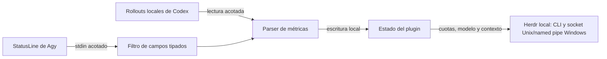

# Auditoría de privacidad y funcionamiento offline

Fecha: 2026-10-09. Alcance: código fuente del fork en `herdr_usage/`, manifiesto,
dependencias declaradas, instaladores, hooks, estado persistente y workflows.
La revisión no utilizó sesiones, prompts ni credenciales reales del equipo.

El código de actualización no contiene un cliente HTTP ni una consulta a APIs de
proveedores. Codex obtiene métricas de archivos locales y Agy de StatusLine.
La revisión encontró rutas indirectas y problemas de privacidad que se han
cerrado en esta revisión. La revisión está compilada con Rust 1.95.0 y
ha sido instalada y activada en el Herdr nativo de este ordenador. Pasan los gates
en Linux/WSL y Windows. La comprobación de syscalls con fixtures se ha ejecutado en
WSL; no constituye una certificación de seguridad absoluta del equipo.

## Hallazgos y cambios

| Hallazgo observado en el código anterior | Riesgo | Cambio aplicado |
| --- | --- | --- |
| El hook Agy pasaba el payload completo al comando StatusLine anterior | Ese comando arbitrario podía almacenar contenido, leer credenciales o transmitirlo por red; no se observó una fuga real | Se elimina la ejecución y el reenvío; el backup sirve únicamente para restaurar la configuración |
| `prompt_cache`/`promptCache` se copiaban íntegros | Campos anidados con prompts o secretos podían acabar en el mailbox local | Lista de campos tipados para warm, TTL y expiración; cuotas aceptan números o timestamps válidos |
| Eventos leían el pane y extraían el prompt como topic | Fragmentos de información propietaria llegaban a metadatos de Herdr y argumentos del proceso local | Se retira toda lectura de terminal; no se producen topics y se excluyen topics/resúmenes heredados de la publicación normal |
| StatusLine podía indicar cualquier `transcript_path` | Lectura de archivos elegidos por el payload, sin una frontera de rutas | Se descarta el campo y se elimina el lector de transcripts de Agy |
| Payload de stdin sin límite y archivos temporales creados con `fs::write` | Consumo excesivo de memoria y escritura siguiendo un enlace simbólico preexistente | Límite de 1 MiB; scratch exclusivo con `create_new`; estado 0700 y reemplazos sensibles 0600 en Unix |
| Workflows Grok enviaban el evento completo de issues/PRs a un webhook | Salida de datos del repositorio a un tercero, independiente del runtime | Se retiran ambos workflows |

No hay evidencia de acceso activo a `auth.json`, Keychain, Credential Manager,
cookies o extracción de API keys en los caminos de actualización. Referencias
históricas, nombres de compatibilidad y fixtures sintéticos no son accesos reales.
Los helpers actuales de identidad de cuenta de Codex devuelven `None`; no abren
una fuente de autenticación.

## Flujo de actualización revisado



`startup`, `refresh`, `event`, `focus` y `watch` resuelven inventario y estado con
Herdr. Ninguno lee salida de terminal. Un evento continúa resolviendo solo el
pane indicado y publicando una vez, con supresión de metadatos sin cambios.
La eliminación de topics heredados ocurre en esa publicación normal; los panes
cuyo viewport está desplazado pueden conservar temporalmente metadatos antiguos
porque el plugin sigue respetando la protección contra repintados.

Codex lee prefijos de identidad y ventanas acotadas de rollouts `.jsonl` o
`.jsonl.zst` en `sessions/` y `archived_sessions/`. Los archivos también contienen
conversaciones: parte de esos bytes puede estar temporalmente en memoria durante
la lectura y el parseo. Solo se extraen modelos, timestamps, IDs, tokens, contexto
y ventanas de cuota. No se conserva ni transmite el transcript completo.

Agy filtra antes de construir el snapshot y vuelve a filtrar al guardarlo. Los
mailboxes heredados también se filtran al cargarlos. No se elimina automáticamente
el contenido de los archivos antiguos ya presentes en disco.

## Lecturas, escrituras y procesos

| Superficie | Acceso | Datos o finalidad |
| --- | --- | --- |
| `CODEX_HOME` o `~/.codex`, bajo `sessions/` y `archived_sessions/` | Lectura | Identidad de sesión y métricas registradas |
| stdin de `agy-statusline` | Lectura acotada, sin reenvío | Campos permitidos de modelo, cuota, contexto y cache |
| `HERDR_PLUGIN_STATE_DIR` o directorio local de `ProjectDirs` | Lectura/escritura | Snapshots, mailbox, IDs técnicos de sesión/pane, coordinación, preferencias y backups |
| `HERDR_PLUGIN_CONFIG_DIR` | Lectura/escritura | Preferencias del plugin |
| CLI de Herdr | Procesos locales | Inventario, snapshot, proceso foreground, estado del pane, metadatos, notificaciones e integración |
| `HERDR_SOCKET_PATH` | IPC local Unix o named pipe Windows | Una petición/respuesta para configurar la vista; el adaptador Windows rechaza rutas UNC remotas |
| `ps` (Unix) / `GetProcessTimes` (Windows) | Metadatos locales de proceso | Tiempo de creación para atribuir Codex; Windows usa `PROCESS_QUERY_LIMITED_INFORMATION` y no lee memoria |
| El propio binario del plugin | Proceso local | Watcher y reinicio del watcher |
| `AGY_SETTINGS_FILE` o `~/.gemini/antigravity-cli/settings.json` | Solo configuración/desinstalación | Preservar settings y sustituir/restaurar StatusLine |
| `HERDR_CONFIG_FILE` o `~/.config/herdr/config.toml` | Configuración; también información de layout al publicar | Configuración de sidebar y backup reversible |
| Estado local `herdr/client-shell`, configuraciones Ghostty/kitty y fuentes del usuario | Lecturas locales; modificaciones de fuentes/mapas solo en configuración | Ancho y representación de sidebar/iconos |

Fuentes principales: [hook Agy](../src/configure/agy.rs),
[adaptador de configuración](../src/configure/statusline.rs),
[filtro y persistencia](../src/cache.rs), [lector Codex](../src/providers/codex.rs),
[integración Herdr](../src/herdr.rs) y [actualización/watch](../src/refresh.rs).

## Qué significa offline

La recolección y presentación pueden operar sin Internet cuando Herdr, el binario
y las fuentes locales están disponibles. Solo muestran observaciones ya producidas:
no consultan cuotas nuevas remotamente ni suponen que una observación vieja sea
una medición fresca. Codex y Agy siguen siendo productos independientes que pueden
hacer sus propias peticiones cuando el usuario los utiliza.

La instalación y la compilación son otra fase. Cargo/rustup pueden descargar
dependencias o toolchains. Para compilar offline, el toolchain `1.95.0`, sus
componentes y las dependencias del lockfile deben estar ya disponibles; después:

```sh
cd herdr_usage
cargo build --release --locked --offline
```

Los instaladores se han normalizado a LF y `.gitattributes` conserva ese formato
para permitir su ejecución desde WSL. La instalación nativa se ha ejecutado y verificado con `install.ps1`.

## Condiciones y riesgos residuales

- Hay que confiar en el binario de Herdr, los productores de métricas y los valores
  de entorno que seleccionan ejecutables y rutas. La ausencia de red en este código
  no impone una sandbox a Herdr, Codex, Agy o al sistema operativo.
- El estado es local, pero contiene IDs técnicos y métricas. Los directorios deben
  estar en un disco local privado, fuera de carpetas sincronizadas o montajes remotos.
  Permisos POSIX no sustituyen las ACL del host ni protegen frente al mismo usuario
  o a un administrador.
- El hook recibe el payload original en memoria para poder filtrarlo. No puede
  impedir que un productor malicioso esconda un secreto en un campo permitido,
  por ejemplo como nombre de modelo. El contrato requiere productores confiables.
- Los backups de configuración pueden contener secretos que el usuario hubiera
  escrito en el archivo de Herdr o en el comando StatusLine original. Se mantienen
  locales para restauración; no los ejecuta el hook. Los backups y cachés antiguos
  no se purgan sin una revisión de su contenido y necesidad de restauración.
- El gate estático detecta regresiones de política conocidas. No es un análisis
  completo de todas las llamadas indirectas ni una prueba de seguridad del binario.

## Verificación realizada y pendiente

| Comprobación | Resultado |
| --- | --- |
| `python scripts/security_audit.py` | Pasa: política estática de dependencias, red, comandos, terminal, payload y estado |
| Parseo de YAML y TOML; sintaxis Python | Pasa |
| `bash -n install.sh uninstall.sh scripts/herdr-action.sh` en WSL | Pasa tras normalizar los finales de línea |
| `cargo fmt --all -- --check` | Pasa tras `cargo fmt` |
| `cargo test --all-targets --all-features --locked` | Pasa: 532 tests en Linux/WSL y 465 en Windows; ejecución secuencial |
| `cargo clippy --release --all-targets --all-features --locked -- -D warnings` | Pasa en Linux/WSL y Windows |
| Pruebas de privacidad y lifecycle del watcher | Pasan, incluyendo el cierre de pipes de captura al iniciar un watcher Windows |
| `strace -f` de red, archivos y exec sobre release Linux | 7 caminos observados con fixtures: cero syscalls AF_INET/AF_INET6, cero lecturas del honeypot auth.json, cero reenvíos de secreto |

## Instalación y prueba real en Windows

- Herdr cliente 0.9.1 / servidor 0.9.3: compatible; se conserva el servidor existente.
- Plugin `herdr-agent-usage`: instalado desde este fork, configurado y activado.
- Acción configure y refresh: terminan con estado `succeeded`.
- Dos panes Codex reales publican modelo, contexto y cuotas; no contienen tokens
  de topic, resumen o contenido conversacional.
- Hook Agy nativo probado con payload sintético: salida vacía, secreto anidado
  eliminado del estado y comando previo sin ejecutar. No había un pane Agy activo
  durante la observación; su actualización real depende del próximo StatusLine.
- SHA-256 del ejecutable instalado: `8e772b29036398a5af4fe8c13a82ca4d3288d7221c5911562049cd478dd40ef6`.
- Los toolchains, compiladores y logs se mantienen locales al proyecto. No se
  modifica el PATH global. El build Windows final usa las dependencias cacheadas
  con `--offline`.

La primera prueba real detectó que un watcher Windows heredaba handles de captura
que mantenían el log de configure abierto. Se corrigió mediante creación del proceso
sin herencia de handles, y una regresión nativa comprueba que el padre termina sin
esperar al watcher. La instalación se repitió y la acción terminó correctamente.

La observación completa de syscalls se limita al binario Linux en WSL con fixtures.
No se realizó captura ETW/WFP completa del binario Windows: la sesión no dispone
de permisos administrativos. La validación nativa comprueba IPC, configuración,
publicación real y filtrado de datos; no se presenta una instantánea TCP como prueba
de ausencia histórica de tráfico. La representación visual de iconos requiere
observación humana y el mapa de fuentes correspondiente en el terminal.

Referencias de plataforma: [transporte IPC de Herdr](https://herdr.dev/docs/socket-api/),
[comandos de plugins Windows](https://herdr.dev/docs/windows-beta/),
[consulta limitada de tiempos de proceso](https://learn.microsoft.com/en-us/windows/win32/api/processthreadsapi/nf-processthreadsapi-getprocesstimes).
