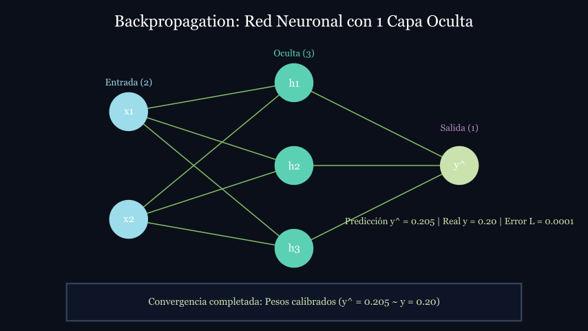

# Animación en Manim: Backpropagation y Pesos

  <video controls autoplay loop class="rounded-xl shadow-2xl border border-slate-700" width="670">
    <source src="../assets/backprop_animation.mp4" type="video/mp4">
    
  </video>

  

    Animación generada con <b>Manim v0.22.0</b>: Se observa el forward pass, la señal de error y el ajuste gradual de pesos en 3 épocas.
  

<!-- notas: Reproducir la animación destacando las 4 etapas: propagación hacia adelante, error en salida, retropropagación de gradientes y ajuste gradual de pesos. -->