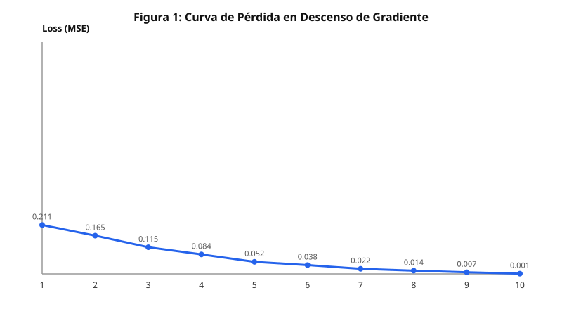

# Actualización de Pesos y Convergencia

### Regla de Descenso de Gradiente

$$w_{ij} \leftarrow w_{ij} - \eta \frac{\partial \mathcal{L}}{\partial w_{ij}}$$

Donde $\eta = 0.5$ es la tasa de aprendizaje (*learning rate*).

### Gradientes por Regla de la Cadena

- **Salida:** $\delta^{(2)} = (\hat{y} - y) \cdot \sigma'(z^{(2)})$
- **Oculta:** $\delta_j^{(1)} = (\delta^{(2)} W_j^{(2)}) \cdot \sigma'(z_j^{(1)})$
- **Ajuste:** $\frac{\partial \mathcal{L}}{\partial w_{jk}^{(1)}} = \delta_j^{(1)} x_k$

Evolución empírica: el error cuadrático desciende de 0.211 a 0.001 tras 10 épocas.

<!-- notas: Concluir destacando cómo el ajuste progresivo de pesos garantiza la convergencia al mínimo de error. -->