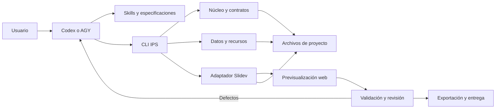

# Arquitectura técnica

**Propósito:** definir la estructura recomendada. **Cuándo leer:** al diseñar o modificar módulos y entorno. Referencias: [componentes](COMPONENTS.md), [modelos](DATA_MODELS.md), [decisiones](DECISIONS.md).

## Núcleo local



El agente produce requisitos, narrativa y propuestas. Las herramientas validan esquemas, calculan datos, aplican cambios, renderizan y exportan. El núcleo no integra un SDK de IA obligatorio. La CLI sirve tanto a una persona como a Codex/AGY y devuelve resultados JSON inspeccionables.

Los nueve módulos funcionales del brief se distribuyen entre procedimientos del agente y cuatro paquetes TS; su [mapeo](COMPONENTS.md) evita crear nueve servicios independientes.

## Fuentes y límites

- Un Markdown por diapositiva conserva contenido, frontmatter y notas.
- Un archivo de entrada conserva orden e inclusiones; ID estable y posición no son equivalentes.
- El manifiesto conserva configuración y referencias, sin copiar texto de diapositivas.
- Storyboard conserva propósito, mensajes, evidencia y estimación temporal, no otra versión del contenido definitivo.
- El índice de dependencias es derivado y reconstruible.
- Markdown/Vue de proyecto es código confiable; documentos importados se mantienen como datos sin ejecución.

No hay IR universal en MVP. La exportación avanzada añadirá una representación derivada del subconjunto portable. No se promete traducir Vue arbitrario, fórmulas, canvas o interacciones en objetos nativos editables. Cada elemento no portable necesita una alternativa estática y reporte.

## Estructura prevista

Los directorios de implementación se crearán cuando su tarea los necesite; esta entrega solo crea documentación.

```text
intelligent_presentation/
  README.md, AGENTS.md, TASKS.md, idea.md
  docs/                    # arquitectura, contratos y PoC
  specs/                   # SDD, trazabilidad y fases
  schemas/                 # esquemas derivados del código
  packages/
    core/                  # TypeScript: modelos, estado, recursos, caché
    cli/                   # TypeScript: interfaz local y diagnóstico
    engine-slidev/         # TypeScript/Vue: motor, layouts, exportación
    quality/               # TypeScript: capturas y validadores
  skills/                  # instrucciones versionadas por procedimiento
  agent-configs/codex/     # fuentes de perfiles específicos
  agent-configs/agy/
  templates/               # catálogo y manifiestos de diseño
  python/                  # opcional: Manim, uv y entornos separados
  projects/                # privados; ignorados por defecto
  examples/                # fixtures públicos y reproducibles
  tests/                   # pruebas compartidas y corpus
  scripts/                 # preparación y diagnóstico locales
  .agents/                 # copias locales y planes internos; ignorado
```

Los tests unitarios propios pueden residir junto a su paquete; `tests/` conserva integración, E2E y fixtures compartidos. Cada proyecto contiene `slides/`, `sources/`, `data/`, `assets/`, `reports/`, `outputs/` y su manifiesto. Cachés/salidas se excluyen de Git salvo evidencias públicas seleccionadas. Los archivos de reconstrucción preservan recursos autorizados y licencia; no incluyen secretos.

## Toolchain y Windows

Node 24 LTS y npm workspaces; TypeScript estricto, Zod, ESLint, Prettier, Vitest, Playwright y axe-core. Fijar versiones exactas y archivo de bloqueo antes de PoC. No se necesita pnpm por usar una biblioteca cuyo repositorio lo usa internamente.

El entorno inspeccionado tenía Node 20.11.0, Python 3.12, uv y AGY CLI 1.3.2; Codex CLI no aparecía en PATH. Estas observaciones no equivalen a compatibilidad probada. El manifiesto consultado de Slidev requiere Node >=22.12.0. Preparar runtime oficial local con checksum, sin reemplazar Node global. Referencias y fecha en [evaluación](TECHNOLOGY_EVALUATION.md).

Flujo Windows futuro, desde este directorio:

1. Ejecutar preparación PowerShell con versiones/checksums fijados.
2. Instalar dependencias locales con `npm ci`; preparar Chromium compatible.
3. Preparar copias locales de skills/perfiles sin tocar configuración global.
4. Ejecutar `ips doctor` y `ips capabilities`; corregir dependencias ausentes.
5. Invocar el agente desde el componente para generar artefactos y usar la CLI.
6. Previsualizar en loopback, validar, aprobar y exportar.

Los comandos IPS aún no existen. La semántica prevista está en [modelos e interfaces](DATA_MODELS.md).

Python llega con la fase 3: uv, entorno virtual, bloqueo de dependencias, Ruff y pytest. Manim no es una dependencia de presentaciones convencionales. Docker/WSL2 se documentan como alternativa para dependencias que fallen en Windows, con intercambio de artefactos por contrato y sin mezclar entornos.

## Compatibilidad y operación

El núcleo consulta capacidades y rechaza formatos no soportados. Schemas incompatibles exigen migración explícita; ninguna lectura modifica automáticamente un proyecto. Los procesos se ejecutan con argumentos separados, directorio conocido, timeout y salida capturada. Logs estructurados registran operación, revisión, duración, caché y fallo sin credenciales ni datos privados completos.

Se mide renderizado frío/caliente, tamaño de artefactos y reutilización para 15, 50 y 100 diapositivas. Los tiempos objetivo se fijarán con hardware y corpus identificados después de una medición inicial; no se presentan cifras sin evidencia.
