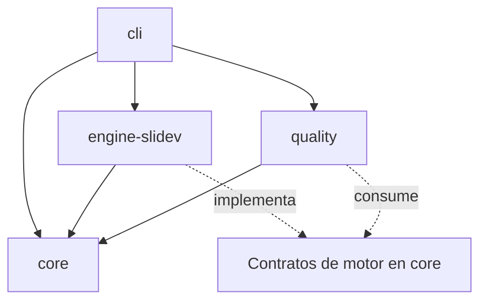

# Componentes y dependencias

**Propósito:** delimitar responsabilidades. **Cuándo leer:** al asignar una tarea o definir límites entre paquetes. Referencias: [arquitectura](ARCHITECTURE.md), [interfaces](DATA_MODELS.md).

| Módulo funcional del brief | Implementación inicial | Responsabilidad |
|---|---|---|
| A. Solicitudes | Agente + CLI | Conversación, requisitos y aplicación de artefactos validados. |
| B. Planificación | Agente + core | Storyboard, tareas; estado, aprobación y recuperación deterministas. |
| C. Contenido/investigación | Agente + core | Narrativa, fuentes, citas; datos y procedencia validados. |
| D. Diseño inteligente | Agente + catálogo | Selección; recomendaciones y variantes ampliadas en fase 2. |
| E. Generación | Agente + engine-slidev | Markdown, notas, layouts y composición. |
| F. Animación/interacción | Adaptadores opcionales | Manim/Python y componentes Vue con alternativa estática. |
| G. Assets/plantillas | core + templates | Catálogo, versiones, licencias y dependencias de recursos. |
| H. Calidad | quality | Capturas, defectos, accesibilidad e informes. |
| I. Entrega | CLI + adaptador motor | Web/PDF y reporte; exportadores avanzados posteriores. |

## Paquetes

| Paquete | Posee | No debe poseer |
|---|---|---|
| core | Esquemas, revisiones, estado, hashes, fuentes, catálogo y datos acotados. Incluye `manifest-utils` para centralizar carga con verificación de revisión, gestión del índice de dependencias e invalidación atómica de reportes. | API específica de navegador o proveedor de IA. |
| engine-slidev | Parseo/inclusiones Slidev, componentes, previsualización y exportación. | Políticas de aprobación propias distintas del núcleo. |
| quality | Inspección estructural/visual, estados de prueba y evidencias. | Modificación automática del significado científico. |
| cli | Traducción de comandos a operaciones, diagnóstico y coordinación. | Copias de modelos ni decisiones implícitas de contenido. |

quality consume descriptores de renderizado/resultados por contrato, sin importar internals de engine-slidev. El núcleo no depende de CLI, Vue, Playwright ni Python. Dependencias circulares bloquean aceptación.

## Extensiones

Adaptadores de motor declaran disponibilidad, versión, formatos, capacidades y operaciones de render/export. Animación devuelve medios y segmentos; interacción devuelve componente registrado, parámetros y estados; exportador devuelve archivos y compatibilidad. No se introduce plugin loader dinámico de código arbitrario en MVP: extensiones se registran explícitamente.

PptxGenJS, Presenton y otros motores se evaluarán como adaptadores independientes; no podrán sustituir silenciosamente el motor elegido. El catálogo ofrece metadatos de capacidades a skills y CLI.
