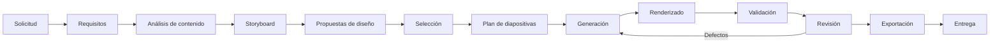
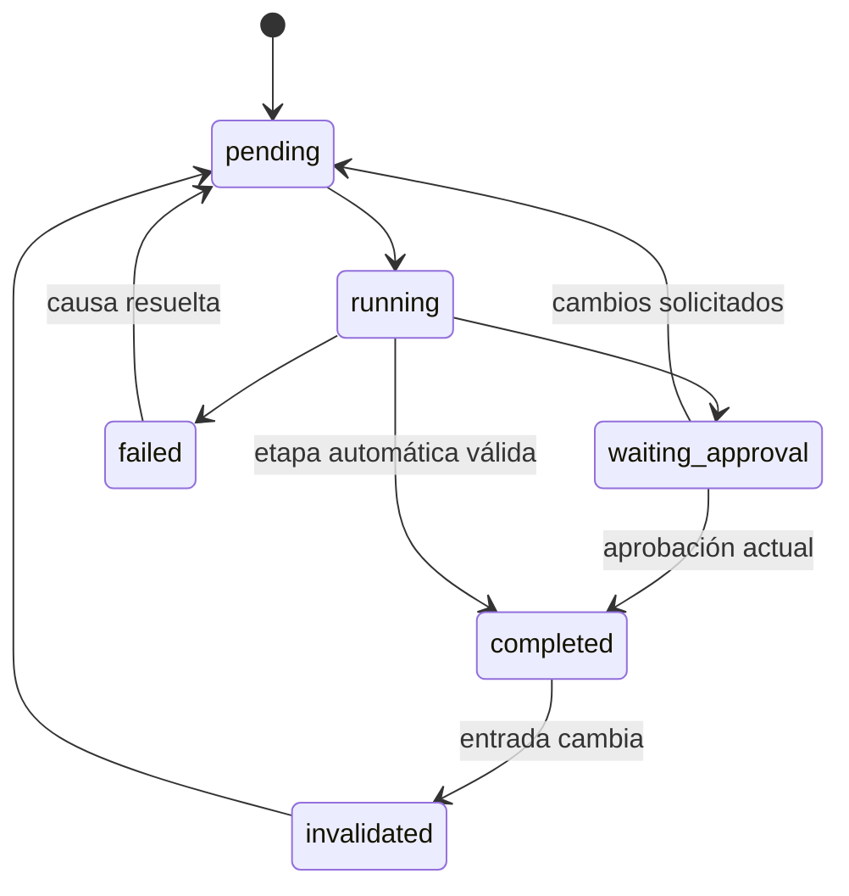
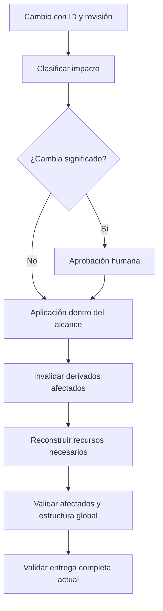

# Ciclo de proyecto, revisiones y recuperación

**Propósito:** definir transiciones y efectos de cambios. **Cuándo leer:** al modificar estado, aprobaciones, caché o exportación. Referencias: [modelos](DATA_MODELS.md), [contratos](DATA_MODELS.md#contratos), [calidad](QUALITY_STRATEGY.md).

## Pipeline

En MVP se muestran dos temas disponibles, sin exigir tres propuestas recomendadas automáticamente. Toda etapa puede revisarse; su cambio invalida dependientes, no la totalidad de fuentes indiscriminadamente.

| Etapa | Artefacto / condición de transición |
|---|---|
| Solicitud | Texto inicial, entradas y autorizaciones identificados. |
| Requisitos | Esquema válido y preguntas críticas resueltas. |
| Análisis | Fuentes clasificadas y faltantes explícitos. |
| Storyboard | Mensajes, evidencia y tiempos; requisitos/storyboard aprobados. |
| Propuestas/selección | Opciones realmente disponibles; diseño aprobado. |
| Plan | Layout, recursos y contenido por ID; dependencias disponibles. |
| Generación | Fuentes aplicadas atómicamente; recursos resolubles. |
| Renderizado | Navegador y fuentes listos; capturas por slide/estado. |
| Validación/revisión | Informe sobre revisión actual y defectos resueltos; entrega aprobada. |
| Exportación | Formatos permitidos y verificación de artefactos. |
| Entrega | ExportReport y archivos coherentes con la revisión aprobada. |

## Estado

Separar `stage` de `status`. Los valores de status son pending, running, waiting_approval, failed, completed e invalidated.

Requisitos/storyboard y diseño requieren aprobación humana. Cambios de significado, narrativa o resultados requieren una aprobación nueva. La entrega final requiere aprobación de la revisión validada. Cambios de composición dentro del diseño aprobado pueden repararse automáticamente; toda nueva revisión invalida su reporte de validación y aprobación final.

Un cambio que afecte un artefacto ya aprobado pone sus aprobaciones dependientes en estado obsoleto. El historial conserva qué se aprobó; no simula aprobación de la revisión actual.

## Escrituras y concurrencia

Cada mutación declara revisión esperada, valida primero, adquiere bloqueo por proyecto y escribe por reemplazo atómico. Un conflicto devuelve REVISION_CONFLICT; no combina cambios de agentes de forma silenciosa. Cada fallo conserva la última revisión válida y un diagnóstico. Las escrituras multiartefacto usan staging y commit de manifiesto; un intento incompleto no se considera proyecto nuevo válido.

## Revisión incremental

La caché incluye hash de contenido/dataset/parámetros, versión del generador, componentes, tema, tipografías, motor y opciones. IDs permanecen estables al reordenar; la posición se resuelve al llamar herramientas que usan números Slidev.

- Cambio de slide: sus capturas y recursos específicos quedan obsoletos.
- Cambio de datos/recurso: invalidar todos los consumidores.
- Cambio de tema/fuentes/componentes compartidos: invalidar diapositivas afectadas o todas si no se puede acotar.
- Cambio de orden: renovar estructura, navegación y exportación; reutilizar assets independientes.

El PDF y bundle final pueden requerir renderizado global del motor; no se promete ensamblado parcial nativo. Antes de entregar, comprobar cobertura de todas las diapositivas/estados de la revisión actual.

## Recuperación

Hasta tres ciclos automáticos de reparación de composición por revisión solicitada. Registrar defecto, cambio e informe posterior. Fallos de datos, falta de evidencia, contenido ambiguo, permisos o cambios semánticos no se solucionan inventando resultados. Tras el límite entregar diagnóstico humano y mantener failed/waiting_approval según causa. Reintentos de exportación reutilizan recursos válidos y no marcan entrega completa si faltan salidas.
