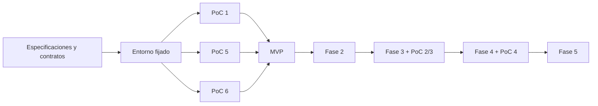

# Roadmap incremental

**Propósito:** ordenar fases y puertas. **Cuándo leer:** al coordinar trabajo o ampliar alcance. Referencias: [backlog](../TASKS.md), [decisiones](DECISIONS.md), [riesgos](RISKS.md).

| Fase | Objetivo y entregables | Dependencias y módulos | Pruebas / cierre | Riesgo principal |
|---|---|---|---|---|
| 0 | Requisitos, documentación, contratos, protocolos de siete PoC; ejecutar 1/5/6. | Brief/preferencias; arquitectura/agentes/calidad/diseño. | Evidencias de edición, defectos y temas; ADR MVP aceptado. | Capacidad documentada distinta de versión real. |
| 1 | CLI, proyectos, CSV/SVG, dos temas, preview, validación, edición y web/PDF. | Fase 0; core/cli/engine/quality. | AC-001–012 y ejemplo con ambos agentes. | Rigor, estado y reparación visual incoherentes. |
| 2 | Cinco familias, componentes, tres propuestas comparables y personalización. | MVP estable; catálogo/diseño/skills. | Mismo contenido, capturas reales y selección humana. | Recomendación estética sin evidencia de utilidad. |
| 3 | Manim opcional, controles Vue, Plotly, estados y alternativas estáticas. | PoC 2/3; adaptadores/Python/quality. | Avance/retroceso, teclado, estados y exportación estática. | Coste de render y dependencias Windows. |
| 4 | PPTX avanzado, reporte por objeto y evaluación de importación externa. | PoC 4; exportadores/subconjunto portable. | OOXML, apertura destino y límites de editabilidad. | Confundir imagen visualmente correcta con contenido editable. |
| 5 | Automatización selectiva, reutilización y recuperación ampliada. | Métricas de uso; core/agentes/quality. | Mejora medida sin regresiones ni duplicación de fuentes. | Complejidad multiagente/GUI prematura. |

## Puertas

G-0 documentación: cobertura del brief, criterios verificables, contratos y tareas coherentes. G-1 arquitectura: PoC 1/5/6 ejecutadas y ADR-005/006/009/010/012 resueltos. G-2 MVP: criterios y revisión humana completos. G-3 extensiones: PoC correspondiente antes de comprometer su adaptador.

La entrega documental actual cubre G-0 como propuesta preparada para revisión; no declara G-1 ni G-2 superadas. La ejecución de PoC/código comienza bajo sus tareas autorizadas. Las [especificaciones de fase 0](../specs/000-evaluation/spec.md) y [MVP](../specs/001-mvp/spec.md) contienen el detalle preparado.

## Unidades de trabajo posteriores

- Fase 2: registrar familias restantes → ampliar tokens/layouts → reglas de recomendación → generar tres variantes → revisión de consistencia/accesibilidad.
- Fase 3: ejecutar PoC 2/3 → cerrar contratos → adaptador Manim/controlador → componente Plotly → alternativas de salida → tests de estados y movimiento.
- Fase 4: ejecutar PoC 4 → clasificar objetos portables → adaptador Slidev editable → adaptador PptxGenJS → verificar destino → especificar importación externa como capacidad independiente.
- Fase 5: medir uso/coste → priorizar capacidad → spec por mejora → experimento comparativo → automatización selectiva y checks de regresión. PoC 7 solo cuando se considere Presenton.

Excel/JSON y análisis avanzado se incorporan con una spec de datos separada y parámetros reproducibles; no se incluyen silenciosamente en la tarea CSV del MVP. GUI propia se decide mediante nuevo ADR después de observar fricción con el flujo de agentes.

## Dependencias

La investigación no mutante de futuras PoC puede adelantarse; no se mezclan sus dependencias ni capacidad experimental con el núcleo del MVP. No hay fechas prometidas sin estimación de esfuerzo tras evaluación.
