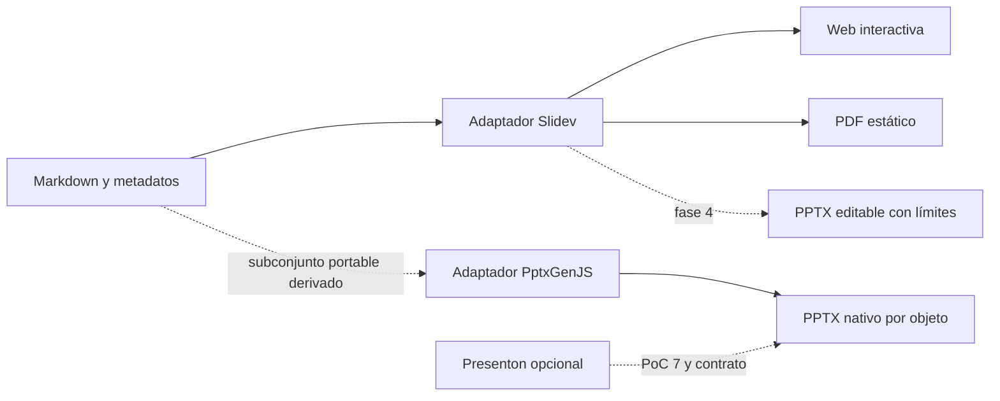

# Evaluación tecnológica

**Propósito:** justificar alternativas y conservar fuentes. **Cuándo leer:** al investigar o revisar una elección técnica. Referencias: [decisiones](DECISIONS.md), [PoC](POC_PLAN.md).

## Estado de evidencia

Investigación documental realizada el 2026-10-10 con fuentes oficiales. `Documentado` significa descrito por la fuente; no significa instalado ni demostrado aquí. Ninguna PoC ha sido ejecutada. Las versiones de documentación/main no prueban la disponibilidad de un paquete publicado: T-003/T-007 deben fijar release, licencia y dependencias efectivamente utilizadas antes de ejecutar experimentos.

## Motor principal: matriz provisional

Escala 1–5; pesos: autoría por agentes 30 %, diseño/componentes 25 %, interacción 20 %, rigor científico 15 %, simplicidad local 10 %. Total = suma de peso × puntuación. Puntuaciones de arquitectura, no benchmark.

| Motor | Autoría | Diseño | Interacción | Rigor | Simplicidad | Total | Motivo / incertidumbre |
|---|---:|---:|---:|---:|---:|---:|---|
| Slidev | 5 | 5 | 5 | 4 | 4 | 4,70 | Markdown/Vue y MCP documentados; comprobar entorno y exportación. |
| reveal.js | 4 | 3 | 5 | 4 | 4 | 3,95 | Control web y API; más integración propia para autoría/diseño. |
| Quarto | 4 | 3 | 3 | 5 | 4 | 3,70 | Flujos científicos fuertes; ajuste a componentes y agentes por verificar. |
| Marp | 4 | 4 | 2 | 4 | 5 | 3,70 | Autoría estática sencilla; interacción avanzada requiere evaluación. |

Recomendación: Slidev, condicionada a PoC 1/5/6. reveal.js es alternativa si falla el ajuste del motor a los contratos. Quarto se reconsidera si el análisis científico pasa a dominar la autoría; Marp para un producto estático más acotado.

## Inventario y fuentes primarias

| Tecnología | Versión/estado consultado | Licencia / verificación | Capacidad y límite |
|---|---|---|---|
| Slidev | Docs y main indican 53.0.0. | MIT declarada; revisar release fijada. | [Markdown/Vue](https://sli.dev/guide/), [MCP desde 52.17.0](https://sli.dev/features/mcp), [exportación](https://sli.dev/guide/exporting). Main exige [Node >=22.12.0](https://raw.githubusercontent.com/slidevjs/slidev/main/packages/slidev/package.json). |
| reveal.js | Documentación actual; release por fijar. | Verificar LICENSE de release. | [HTML/Markdown, API, notas y PDF](https://revealjs.com/). |
| Quarto | Documentación actual; release por fijar. | Verificar licencia de distribución y dependencias. | [Presentaciones](https://quarto.org/docs/presentations/); evaluar alcance científico/multiformato. |
| Marp | Documentación actual; release por fijar. | Auditar CLI/Core y dependencias por separado. | [Ecosistema Markdown](https://marp.app/); no asumir interacción web equivalente a Vue. |
| Manim Community | Docs stable identificadas como 0.22.0. | Verificar release y recursos externos. | [Instalación Windows/Python](https://docs.manim.community/en/stable/installation.html); dependencias opcionales y coste de render pendientes. |
| Manim Slides | Docs latest; release por fijar. | Revisar LICENSE y dependencias Qt. | [Presentación controlada](https://manim-slides.eertmans.be/latest/); no asumir embebido Slidev sin PoC. |
| Motion Canvas | Candidato sin evaluación documental cerrada. | T-003 debe verificar fuentes/licencia. | Evaluar solo si SVG/CSS/Manim no cubren la necesidad. |
| Vue/Plotly.js | Versiones por fijar. | Auditar paquetes exactos. | Proveedor interactivo inicial propuesto; PoC 3 debe probar su integración. |
| D3/ECharts/Three.js | Candidatos sin adopción inicial. | T-003 debe verificar documentación y licencias. | Usar solo para necesidad concreta; no instalar todos por defecto. |
| Mermaid/SVG/CSS | Según motor y componentes fijados. | Assets y paquetes con atribución propia. | Diagramas y movimiento simple; no confundir SVG con objetos PPTX editables. |
| PptxGenJS | Docs actuales; release por fijar. | Auditar release. | [Texto, tablas, formas, imágenes y gráficos; tipos TS](https://gitbrent.github.io/PptxGenJS/). La compatibilidad visual se demuestra en PoC 4. |
| Presenton | README actual; release/API por fijar. | Apache-2.0 declarada; auditar dependencias. | [API, MCP y ejecución local](https://github.com/presenton/presenton); medir integración, transmisión y editabilidad real. |
| Playwright | Docs actuales; paquete/navegador por fijar. | Auditar paquete y distribución de navegador. | [Comparación visual](https://playwright.dev/docs/test-snapshots) y [accesibilidad](https://playwright.dev/docs/accessibility-testing); revisión manual sigue siendo necesaria. |
| Codex | Documentación oficial; CLI no encontrado en PATH local. | Condiciones de plataforma y versiones por registrar. | [AGENTS.md](https://learn.chatgpt.com/docs/agent-configuration/agents-md), [skills](https://learn.chatgpt.com/docs/build-skills), [subagentes](https://learn.chatgpt.com/docs/agent-configuration/subagents). |
| Antigravity | CLI local 1.3.2; docs actuales cubren varias superficies. | Condiciones de plataforma; perfiles según CLI instalado. | [Rules](https://www.antigravity.google/docs/rules/), [skills](https://www.antigravity.google/docs/skills/), [MCP](https://www.antigravity.google/docs/mcp/), [subagentes](https://www.antigravity.google/docs/subagents/). |
| Node | Local 20.11.0; elegir 24 LTS. | Runtime oficial y checksum a fijar. | [Releases oficiales](https://nodejs.org/en/about/previous-releases). |

La guía [GitHub Spec Kit](https://github.com/github/spec-kit) aporta un ciclo de especificación/plan/tareas útil como referencia metodológica. La preferencia confirmada es usar artefactos portables, sin instalar Spec Kit obligatoriamente.

## Exportación PowerPoint

Slidev documenta `pptx` como slides rasterizadas y `pptx-editable` como reconstrucción de objetos nativos. SVG, canvas, iframe, vídeo, fórmulas y ciertos efectos CSS permanecen como imágenes. Puede rasterizar una slide completa si no puede reconstruirla de forma segura. Fuentes no se incrustan; wrapping puede diferir. Estas limitaciones documentales deben contrastarse con el corpus de PoC 4, incluido texto, tablas, gráficos y notas.

## Alternativas arquitectónicas clave

| Elección | Recomendación y consecuencia | Incertidumbre / prueba |
|---|---|---|
| Markdown vs IR universal | Markdown + metadatos evita duplicación; IR portable derivada después. | Edición/tema: PoC 1/6. |
| Manim vídeo vs frames vs Manim Slides | Vídeo segmentado: controles Vue; frames: más tamaño/gestión; player dedicado: más dependencia. | PoC 2. |
| Interacción web vs formatos estáticos | Web completa; PDF/PPTX reciben estado y descripción de pérdidas. | PoC 3/4. |
| Slidev editable vs PptxGenJS | Comparar fidelidad, objetos, notas y mantenimiento; no elegir por etiqueta editable. | PoC 4. |
| Presenton vs núcleo propio | Fuera por defecto; opcional si gana en capacidades sin perjudicar trazabilidad/privacidad. | PoC 7. |
| Agente único vs multiagente | Uno con herramientas; especialistas por trabajo y revisión independiente. | Medición de fase 5. |
| Skills/MCP vs CLI | Skills enseñan flujo; CLI verifica; MCP Slidev puede facilitar edición. | PoC 1 por plataforma. |
| Declaración vs componentes | Tokens/manifiestos para estilo; Vue para comportamiento controlado. | PoC 6. |
| Incremental vs regeneración | Assets por hash y dependencias; ensamblado global del motor cuando sea necesario. | AC-008/010. |
| Revisión visual automática vs humana | Geometría/recursos deterministas y rúbrica humana; visión IA es auxiliar. | PoC 5. |
| Agentes vs GUI propia | Agentes iniciales; GUI solo con evidencia de fricción. | Evaluación después del MVP. |

## Cierre de investigación

T-003 completará los candidatos no verificados con enlaces oficiales, release, LICENSE, dependencias y mantenimiento observado. Una referencia a main se sustituirá por tag/commit fijado en el registro experimental. Recomendación, capacidad documentada y resultado ejecutado se almacenan en campos diferentes; un candidato puede descartarse con justificación antes de instalarlo.
